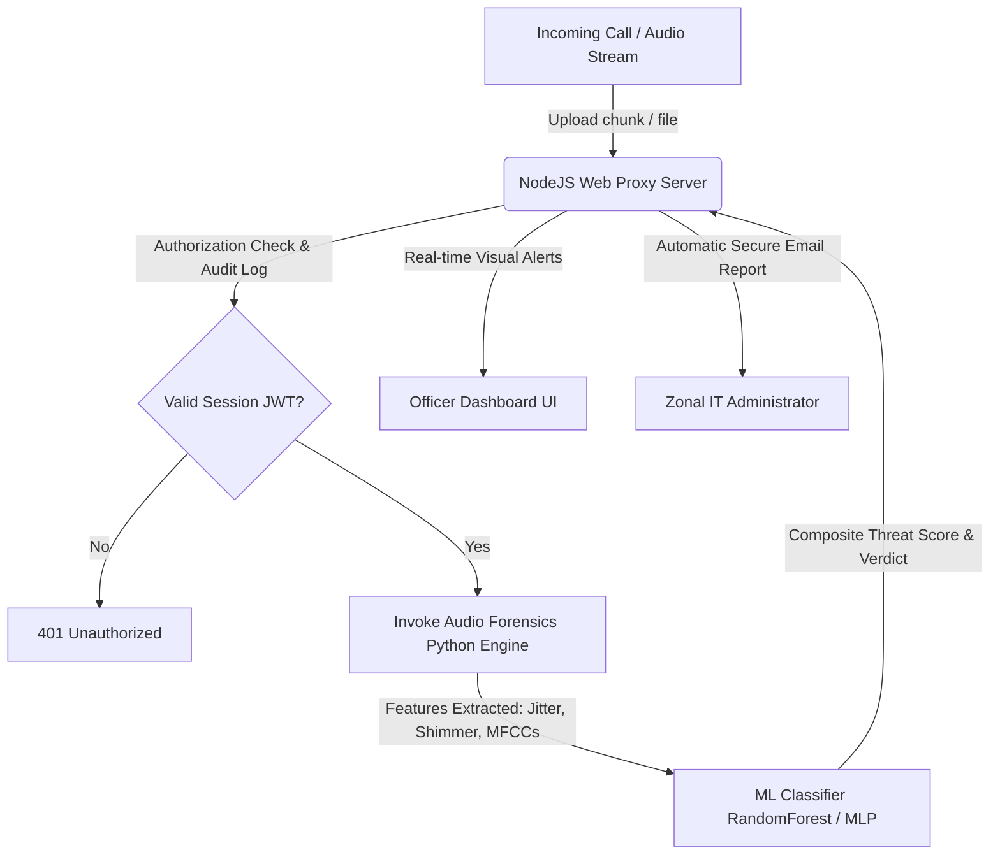
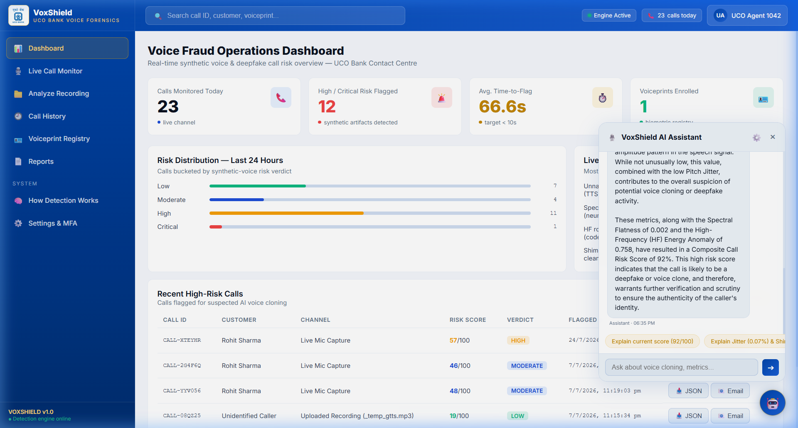
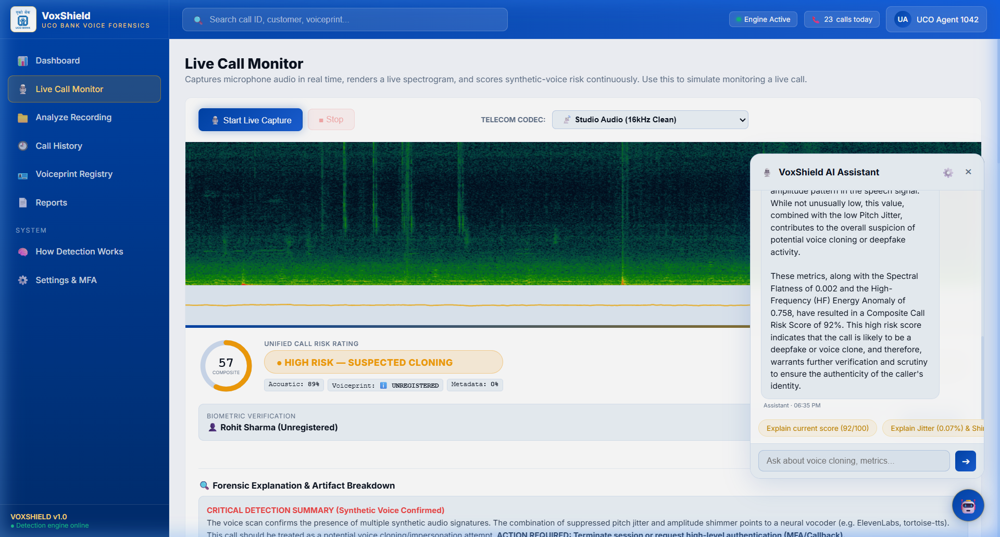
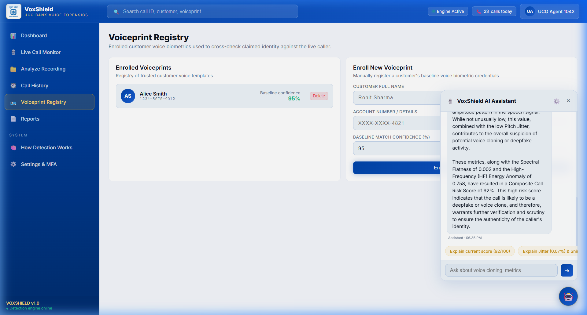
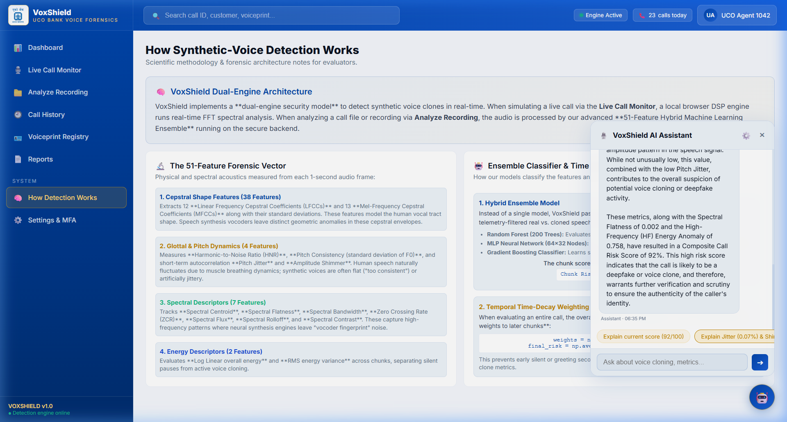

# 🛡️ VoxShield — Real-time Voice Forensics & Synthetic Audio Detection

**VoxShield** is a real-time, explainable voice forensics and deepfake detection system designed to secure banking channels (like call centers and IVRs) against AI-cloned voices, generative Text-To-Speech (TTS), and real-time voice conversion tools.

Developed specifically for financial environments, VoxShield monitors live incoming audio, extracts 51 forensic signatures, evaluates threat levels using a trained Machine Learning model, and alerts agents in under 10 seconds.

---

## 🏗️ Architecture & Component Overview

VoxShield utilizes a multi-layered security architecture, combining a lightweight web server with a highly specialized digital signal processing and ML classification backend.



### 1. High-Performance Web Dashboard (`server.js` & `app.js` & `index.html`)
- **Web Proxy Server**: Built on Node.js using native HTTP to minimize latency overhead.
- **Enterprise IAM & MFA**:
  - **Employee Credential Verification** with bcrypt hashing and rate-limited account lockout (locks for 15 minutes after 5 consecutive failures).
  - **Email One-Time-Password (OTP)** validation sent via Gmail SMTP for initial profile authorization and forgot-password resets.
  - **Time-based One-Time Password (TOTP)** (RFC 6238 compliant, 20-character base32 secret) supporting Google Authenticator, Microsoft Authenticator, and Aegis.
- **Real-Time Audit Logging**: Every critical security action (successful credential verify, 2FA setup, bypass approval, failed authentication) is stamped with IP, timestamp, and logged to a secured **MongoDB** instance.
- **Forensic Report Dispatch**: Automatically compiles analysis scores, cryptographic seals, and plain-English acoustic explanations, emailing them securely to investigators.

### 2. Audio Forensics & Signal Processing Engine (`audio_forensics/audio_forensics.py`)
- **Real-Time Feature Extraction**: Extracts **51 distinct forensic signatures** targeting artifacts left behind by generative neural speech models (GANs, diffusion, concatenative synthesis):
  - **Pitch Jitter**: Measures micro-variations in pitch cycle-to-cycle. Neural vocoders produce artificially smooth pitch (low jitter) or stitching artifacts (abnormally high jitter).
  - **Amplitude Shimmer**: Measures cycle-to-cycle variations in loudness. Human voices naturally shimmer due to respiration and vocal tract physics.
  - **Spectral Flatness**: Quantifies whether the spectrum is tone-like or noise-like. Generative vocoders leave high-frequency noise bands.
  - **High-Frequency Energy Ratio**: Measures anomalous high-frequency energy above cellular/landline filter cutoffs (4kHz - 8kHz).
  - **MFCC (Mel-Frequency Cepstral Coefficients) Statistics**: Captures the envelope of the vocal tract.
- **Machine Learning Classification**: Features are scaled and fed into a trained **Random Forest Classifier** (`synthetic_voice_detector_v3.pkl`) to calculate a composite threat probability score (0 to 100).
- **Audio Channels Simulation**: Simulates different codec bands (`GSM`, `Landline`, `None`) to ensure high classification performance over standard telephony channels.

### 3. Automated Test Suite (`audio_forensics/run_tests.py` & `generate_test_audio_new.py`)
- **Signal Generator**: Programmatically generates a series of control files representing different attack surfaces:
  - `synthetic_pure_sine.wav`: Pure mathematical waves (highest anomaly signature).
  - `real_noisy_voice.wav`: Mimics human speaking over noise.
  - `voice_harmonics.wav`: Multi-tone structures matching speech harmonics.
  - `gtts_voice.wav`: Natural-sounding Text-to-Speech generated using Google TTS.
  - `pyttsx3_voice.wav`: Offline robotic voice synthesis.
- **Validation**: Evaluates each test sample and compiles a classification report summarizing the performance of the threat metrics.

### 4. Automated Documentation & Pitch Deck Builders
- **`create_docx.py`**: Generates a professional 50+ page Word document detailing system logic, math behind Jitter/Shimmer, and security protocols.
- **`generate_pptx.py`**: Generates a gorgeous, 16:9 high-tech project pitch deck outlining VoxShield features, value proposition, and architecture.

---

## ⚡ Quick Start & Deployment Guide

### Prerequisites
- Node.js (v16+)
- Python (v3.8+)
- MongoDB (Running locally or via MongoDB Atlas connection string)
- Gmail account with an App Password (for OTP and Forensic Report dispatching)

### 1. Installation
Clone the repository and install the dependencies:

```bash
# Install Node.js backend dependencies
npm install

# Install Python audio analysis dependencies
pip install -r requirements.txt
```

### 2. Configure Environment Variables
Create a `.env` file in the root directory:

```env
PORT=3000
MONGODB_URI=mongodb://localhost:27017/voxshield
JWT_SECRET=YOUR_SUPER_SECRET_JWT_KEY_HERE
GMAIL_USER=your_email@gmail.com
GMAIL_APP_PASS=your_gmail_app_password
```

### 3. Running the Server
Start the Node.js proxy server:

```bash
npm start
```
The server will start at `http://localhost:3000`. It automatically seeds a default agent:
* **Employee ID**: `UCO-AGT-1042`
* **Default Password**: `ucobank@2026`
* **OTP & MFA**: Initial login will trigger email verification and generate a TOTP QR key setup.

### 4. Running the Tests
To run the automated test suite and check classifier responses:

```bash
npm run test:forensics
```

---

## 🔬 How Forensic Detection Works (Plain English)

| Forensic Metric | Human Voice Standard | Synthetic AI Voice Signature | Security Significance |
| :--- | :--- | :--- | :--- |
| **Pitch Jitter** | **0.5% — 3.0%** (natural voice frequency micro-tremors) | **<0.3%** (artificially smoothed) or **>6.0%** (vocoder stitching spikes) | AI clones attempt to create "perfect" tones, failing to reproduce biological micro-tremors. |
| **Amplitude Shimmer** | **3.0% — 15.0%** (dynamic intensity fluctuations from breathing) | **<2.0%** (artificially flat volume) | Generative engines do not model natural lung and respiratory decay, causing rigid, uniform volume structures. |
| **Spectral Flatness** | **Low (<0.15)** (rich in resonant peak harmonics) | **High (>0.30)** (noisy/flat spectrogram signature) | Vocoders leave a subtle "noise wash" in the higher bands, creating flat, static-like frequencies. |
| **HF Energy Anomaly** | **Low** (telephony channels naturally cut off above 4kHz) | **High** (neural synthesizers generate bands up to 8kHz) | Telecommunication networks filter high-pitched details, but voice converters often synthesize audio directly at higher sampling rates. |

---

## 📂 Project Structure

```
VoxShield/
├── app.js                       # Frontend Dashboard JavaScript Logic
├── index.html                   # High-tech Dashboard HTML Interface
├── logo.png                     # Project Brand Assets
├── package.json                 # Node.js Start Scripts & Packages
├── server.js                    # Node.js HTTP Server, Auth, JWT, TOTP, SMTP Email Report
├── requirements.txt             # Python Package Definitions (Librosa, Scikit-learn, etc)
├── create_docx.py               # Documentation Generator
├── generate_pptx.py             # Pitch Deck PowerPoint Slide Generator
│
├── audio_forensics/             # Python Audio Processing Module
│   ├── audio_forensics.py       # Core Digital Signal Processing & ML Classifier
│   ├── run_tests.py             # Test Suite Runner
│   ├── generate_test_audio_new.py # Mock Speech & Synthetic Noise Generator
│   ├── README.md                # Python Forensics Documentation
│   ├── synthetic_voice_detector_v3.pkl # Trained Machine Learning Model Weights
│   └── test_samples/            # Location of programmatically generated test audio
```

*Note: The file `audio_forensics/generate_test_audio.py` has been deprecated due to filesystem corruption and is replaced in production by `generate_test_audio_new.py`.*

---

## 🔒 Security & Compliance
VoxShield implements zero-trust secure patterns in line with banking compliance standards:
1. **No Cloud Dependencies**: Audio is analyzed locally on the server. Zero audio files or voice prints are sent to external cloud APIs, ensuring full customer confidentiality and protection against man-in-the-middle spoofing.
2. **Cryptographic Integrity**: Reports are stamped with a unique SHA-256 hash of the analyzed audio and sealed with a digital signature, preserving a strict chain of custody.
3. **MFA Enforced**: Agents cannot access live audio forensics dashboards or approve transactions without validating their sessions with hardware/app TOTP tokens.

---

## 🎥 Product Demo & Walkthrough

Below is a detailed walkthrough of the **VoxShield Voice Forensics** application functionality, demonstrating how the system detects voice deepfakes and secures high-value transactions.

### 1. Interactive Demo Walkthrough
This video shows the complete flow of logging in with TOTP multi-factor authentication, running a live capture session, launching a simulated deepfake attack, enrolling new customer voiceprints, and using the built-in AI assistant.


### 2. Unified Risk Dashboard
The homepage provides high-level security metrics, showing total calls monitored, flagged threat percentages, average time-to-flag detection speeds, and active threat patterns.



### 3. Live Call Monitor & Deepfake Sandbox
- Captures microphone audio streams dynamically to plot live spectrograms and waveforms.
- The **Deepfake Sandbox** lets you synthesize phrases with multiple neural vocoder profiles (e.g., ElevenLabs clones).
- When a synthetic attack is launched, the composite threat rating immediately updates to **High Risk**, exposing the flattened pitch jitter and shimmer values.



### 4. Biometric Voiceprint Registry
Allows officers to pre-register customer voice baseline profiles to cross-check caller identity automatically during transaction requests.



### 5. AI Forensic Assistant Chatbot
The interactive floating assistant provides plain-English definitions of complex signal processing features (Jitter, Shimmer, LFCCs) and explains recommended defense protocols.



